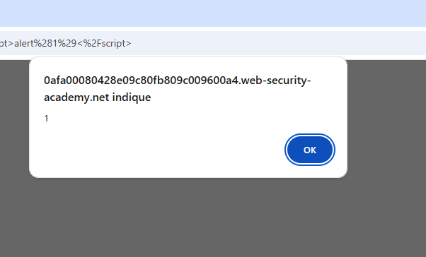
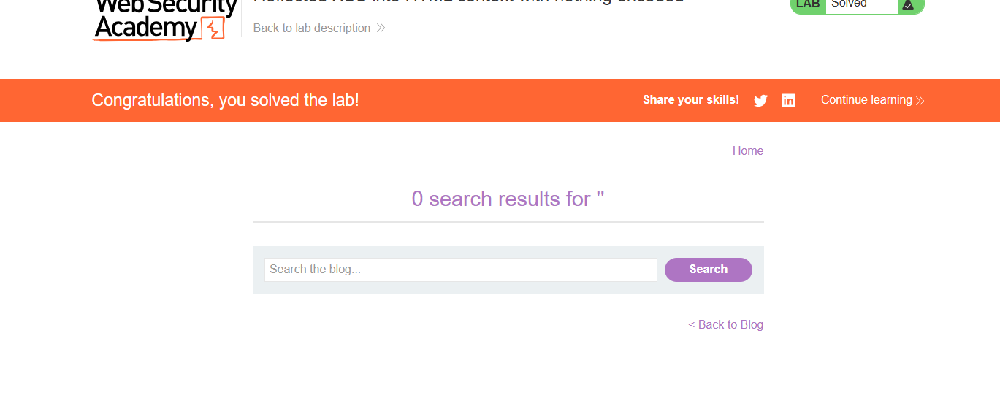
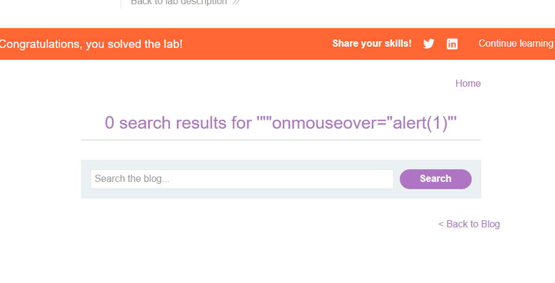

**question 1:**

Différence entre labo 1 et labo 2:

Labo 1 explication:
Pour faire simple on a piégé le navigateur pour pouvoir apparaître une popup piégé pour pouvoir prendre le contrôle du navigateur

Cette popup a permis la validation du lab 1 mais surtout permet de prendre le contrôle en cachant un lien piégé dans la popup pour poivoir prendre le contrôle et pouvoir se connecter en compte administrateur en remplacant les éléments de recherche par l'injection XSS dans la barre de recherche on a pu faire l'injection du code malveillant

Pour ce qui est de différent dans le labo 2 c'est que ceci est fait dans un commentaire de blog on a exploité une faille en injectant du javascript dans un commentaire en piégant la photo. La méthode la plus efficace serait la méthode stored déjà en terme de dangerosité mais aussi et surtout en terme de passer inaperçu pour faire de l'élevage de privilège et de se connecter en administrateur.

**question 2:**

Dans le lab 3 l'injection classique ne fonctionnne pas car l'injection <script>alert<script> est fait pour placer une popup quand, alors que la on peut se servir pour piégé la recherche en faisant en sorte d'injecter en paramètre l'évenement: "onmouseover="alert(1) qui permet de créer un événement quand on passer la souris dans la barre de recherche dans le but de piéger. Les caractères < et > ou plutôt chevron permettent de casser ou annuler le HTML dans le code source de l'application web et qui permet la création de la backdoor dans le code pour l'injection XSS.

**question 3**

Les caractères ' * ;  // Le caractère // permet de créer des commentaires qui va ignorer le reste du script pour faire en sorte que le navigateur lit que l'injection XSS. On va injecter ces attributs dans le navigateur comme pour les injections SQL.

**question 4:**

Le pare feu aura du mal à détecter l'attaque DOM XSS car elle s'effectue côté client et pas côté serveur alors que le firewall s'occupe que du côté serveur. Alors que le Reflected XSS se fait directement dans la recherche et donc sera plus facile à repérer pour les applications protégés correctement contre cette attaque c'est pour cela que le firewall est un excellent moyen contre les injections XSS

**question 5**

Si je suis développeur j'interdit j'encode toutes les données afin que mon code soit à première vue soit chiffré afin d'éviter que toute personne ou hacker puissent injecter du XSS dans mon code afin de préserver sa sécurité. Et puis en chiffrant mon code je pourrai ainsi mieux sécuriser mon application ou site web et je serai le seul à pouvoir connaître mon code et les moyens de sécurité employé à la protection des failles XSS
