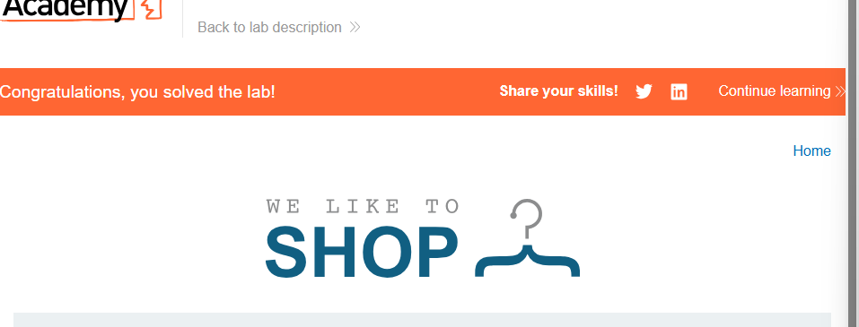
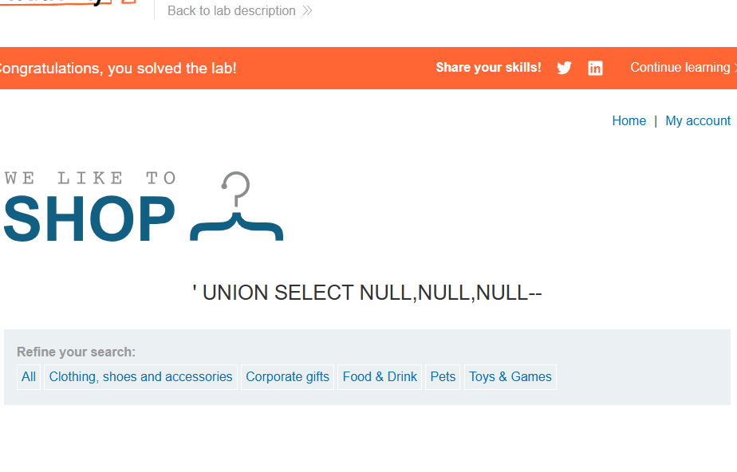
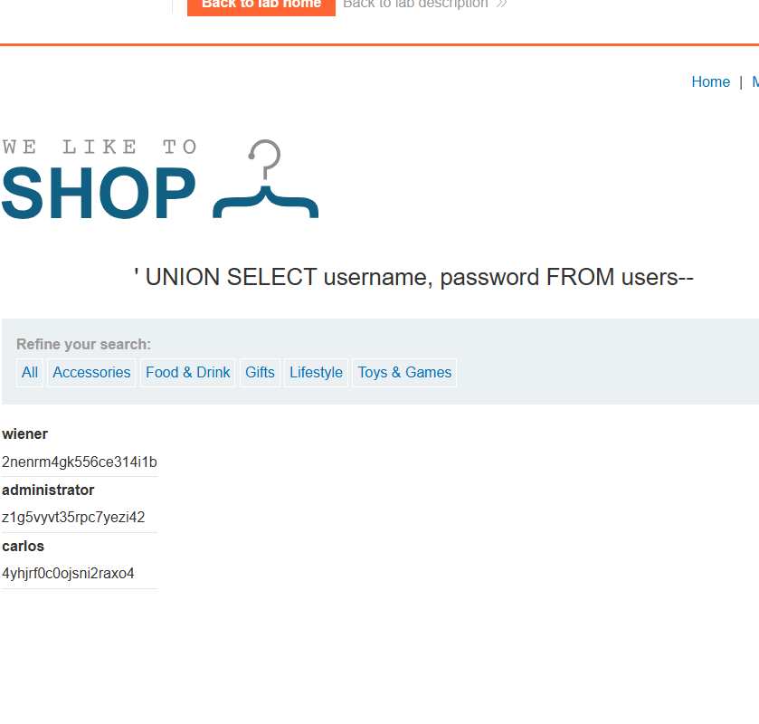

Pour commencer Le Labo 1:

T1: L'ajout de Or 1=1 permet d'afficher les données car on dit de remplacer un filtre par une requête qui est tout le temps vrai en effet les booléens sont des variables qui fonctionnent comme le binaire avec des 0 et des 1 pour faire simple la requête c'est comme si on disait qu'on remplassait le filtre catégorie par cette requête tout le temps vrai c'est comme si on disait qu'on voulait accèder au produit non commercialisé en remplacent le filtre par cette requête et d'exclure le filtre en effet car en mettant cette requête on a pu accèder à des produits non catalogué car -- en SQL signifie rajouter un commentaire et se concentrer que sur ce qui est vrai

**Question 2**: Comme dit plus tôt ces caractères la -- et celui là # permettent en gros de faire dse commentaires et d'exclure la le reste du de la requête. Il permet de bypasser le mot de passe car il se concentre uniquement sur l'utilisateur admin, mais aussi de permettre de rechercher le mot de passe admin dans la BDD afin de pouvoir trouver le mot de passe correspondant

**Question 3**: Le fait de connaître exactement les colonnes permet à l'attaquant d'exfiltrer toute la base de donnée sans qu'une partie l'en échappe. Si les 2 BDD n'ont pas la même structure et n'ayant pas le nombre de colonne exact cela peut créer des problèmes de collision si on veut intéragir avec ces 2 bases de données et qu'on evoie une requête qui n'ont pas la même structure et cela peut empêcher l'exfiltration complète.

**Question 4**: Pour se protèger des caractères comme or ou ' on peut faire ce que l'on appelle une requête préparé paramétré cela permettra de faire une réquete au préalable afin l'empêcher ces caractères

image::images/Labo 3 réussite.png

**question 5:** Les hackers pour pouvoir faire ce genre de techniques ils vont esssayer toute les combinaisons possibles:

- temps de chargement: en effet si un temps de chargement met plus de temps cela veut dire un mot de passe plus long ou au contraire un temps de chargement plus court signifie un temps de téléchargement plus court

- longueur: en efet pour les hackers il est important de savoir la longueur d'un mot de passe et peut influer sur le temps de chargement

- caractères: si un caractère n'est pas redondant ca peut avancer et réduire les possibilités, si un caractère unique, cela va mettre plus de temps

C'est plus long que UNION car c'est à l'aveugle alors que UNION on contactenaque plusieurs bases de donnée en même temps pour pouvoir faciliter la recherche alors que la méthode blind se base sur quelquechose d'aléatoire c'est ca passe ou ca casse

