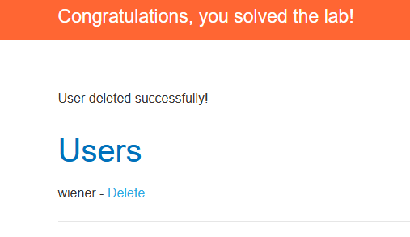
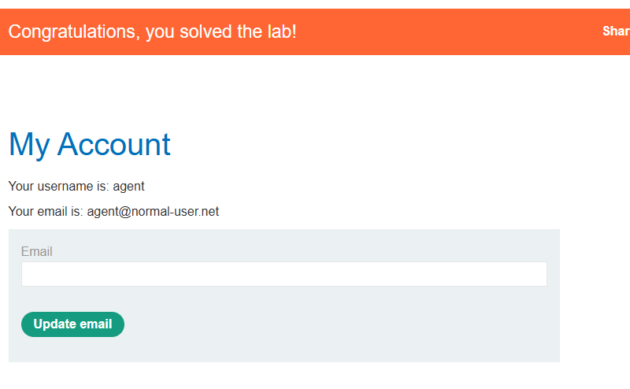

Pour le labo 1

Pour le labo 1 il s'agissait de manipuler un cookie pour pouvoir se connecter en admin avec un compte lambda en modfiiant la valeur de admin=false par admin=true on pouvait accéder en admin et pour voir supprimer des profils utilisateurs. Avec l'aide du cookie on a pnsi profiter du compte administrateuru effectuer une élévation de privilège et ai

Pour le labo 2

Il s'agissait ici d'une attaque par dictionnaire et par brute force dans le but de trouver un mot de passe avec BurpSuite grâce à l'intruder on a pu alors sélection username et password et ainsi regarder dans la colonne username lors de l'attaque la colonne lengths et pour le password il s'agissait du passowrd code, on a pu alors se connecter avec un username et password qu'on avait pas en testant un username et password complétement faux pour récuperer le username et faire la même attaque pour récupérer le password associer

